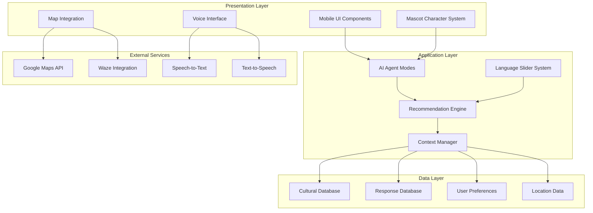

# Design Document: Kawan AI - Malaysian AI Buddy Mobile App

## Overview

Kawan AI is a mascot-centric mobile application that serves as a hyperlocal AI buddy for Malaysian life. The app features an animated mascot character that provides culturally authentic recommendations for food, activities, and places using Malaysian slang and local context. Built as a hackathon prototype, the system prioritizes cultural authenticity, engaging user experience, and technical innovation through a mascot-first architecture.

### Key Design Principles

1. **Mascot-First Architecture**: The animated mascot character is the central interface element, driving all user interactions and system responses
2. **Cultural Authenticity**: Deep integration of Malaysian culture, language patterns, and local context throughout the system
3. **Adaptive Communication**: Progressive slang learning system that adjusts language complexity based on user preferences
4. **Contextual Intelligence**: Multi-factor recommendation engine considering location, mood, time, budget, and cultural context
5. **Malaysian Identity**: Visual design system based on Malaysian flag colors (red, blue, white, yellow) throughout the interface

### Target Users

- **University Students**: Budget-conscious users seeking affordable local experiences
- **Newcomers to Malaysia**: Tourists and expats learning Malaysian culture and language
- **Local Malaysians**: Users seeking authentic local recommendations and hidden gems

## Architecture

### System Architecture Overview

The Kawan AI system follows a modular, component-based architecture optimized for rapid prototyping and cultural authenticity:



### Core System Components

#### 1. Mascot Character System
- **Animated Character Engine**: React Native Reanimated for smooth mascot animations
- **Personality Modes**: Four distinct mascot personalities corresponding to AI agent modes
- **Expression System**: Dynamic facial expressions and gestures based on conversation context
- **Voice Integration**: Synchronized lip-sync animations with Malaysian-accented TTS

#### 2. AI Agent Mode System
- **Mode Controller**: Manages switching between four specialized recommendation modes
- **Context Adaptation**: Adjusts mascot personality, response patterns, and recommendation filters
- **Mode-Specific Logic**: Specialized recommendation algorithms for each agent mode

#### 3. Cultural Intelligence Engine
- **Malaysian Context Database**: Hardcoded knowledge of neighborhoods, cultural practices, and local customs
- **Slang Processing System**: Natural language processing for Malaysian English patterns
- **Cultural Recommendation Filter**: Ensures all suggestions respect Malaysian cultural diversity and religious considerations

#### 4. Adaptive Language System
- **Slang Intensity Controller**: Five-level slider from Full English to Full Malaysian Slang
- **Translation Layer**: Real-time conversion between language levels
- **Learning Support**: Contextual tooltips and explanations for Malaysian expressions

## Components and Interfaces

### Mobile Application Framework

**Technology Stack**: React Native with Expo for rapid prototyping
- **Animation Library**: React Native Reanimated 3 for mascot character animations
- **UI Components**: React Native Elements with Malaysian flag color theming
- **Navigation**: React Navigation 6 with custom mascot-integrated transitions
- **State Management**: React Context API for prototype simplicity

### Mascot Character Component

```typescript
interface MascotCharacter {
  currentMode: AIAgentMode;
  animationState: AnimationState;
  expression: FacialExpression;
  voiceState: VoiceState;
  
  // Methods
  switchMode(mode: AIAgentMode): void;
  playAnimation(animation: AnimationType): void;
  speak(text: string, slangLevel: number): void;
  reactToUserInput(input: UserInput): void;
}

enum AIAgentMode {
  JOM_LEPAK_LU = "jom-lepak-lu",
  TEMPAT_HEALING = "tempat-healing", 
  MAKAN_BOSS = "makan-boss",
  JALAN_JALAN_CARI_MAKAN = "jalan-jalan-cari-makan"
}

enum AnimationType {
  GREETING = "greeting",
  THINKING = "thinking",
  EXCITED = "excited",
  EXPLAINING = "explaining",
  LISTENING = "listening"
}
```

### Chat Interface Component

```typescript
interface ChatInterface {
  messages: ChatMessage[];
  currentSlangLevel: number;
  voiceEnabled: boolean;
  
  // Methods
  sendMessage(message: string): void;
  sendVoiceMessage(audioBlob: Blob): void;
  adjustSlangLevel(level: number): void;
  showTranslation(message: ChatMessage): void;
}

interface ChatMessage {
  id: string;
  sender: 'user' | 'mascot';
  content: string;
  timestamp: Date;
  slangLevel: number;
  translations?: Translation[];
  audioUrl?: string;
  recommendations?: Recommendation[];
}
```

### Recommendation Engine Component

```typescript
interface RecommendationEngine {
  currentMode: AIAgentMode;
  userContext: UserContext;
  
  // Methods
  generateRecommendations(query: string): Recommendation[];
  filterByDietaryPreferences(recs: Recommendation[]): Recommendation[];
  applyBudgetFilter(recs: Recommendation[], budget: BudgetRange): Recommendation[];
  addCulturalContext(recs: Recommendation[]): Recommendation[];
}

interface Recommendation {
  id: string;
  title: string;
  description: string;
  category: RecommendationCategory;
  location: Location;
  dietaryCategories: DietaryCategory[];
  budgetRange: BudgetRange;
  culturalContext: string;
  imageUrl: string;
  mapData: MapData;
}

enum DietaryCategory {
  HALAL = "halal",
  VEGETARIAN = "vegetarian", 
  NON_HALAL = "non-halal",
  VEGAN = "vegan",
  SPICY = "spicy",
  MILD = "mild"
}
```

### Voice System Component

```typescript
interface VoiceSystem {
  isRecording: boolean;
  isPlaying: boolean;
  malaysianAccent: boolean;
  
  // Methods
  startRecording(): void;
  stopRecording(): Promise<string>;
  playAudio(text: string, slangLevel: number): void;
  processVoiceInput(audioBlob: Blob): Promise<string>;
}
```

### Map Integration Component

```typescript
interface MapIntegration {
  currentLocation: Location;
  recommendations: Recommendation[];
  
  // Methods
  showRecommendationsOnMap(recs: Recommendation[]): void;
  navigateWithWaze(location: Location): void;
  navigateWithGoogleMaps(location: Location): void;
  calculateDistance(from: Location, to: Location): number;
}
```

## Data Models

### User Profile Model

```typescript
interface UserProfile {
  id: string;
  userType: UserType;
  preferredSlangLevel: number;
  dietaryPreferences: DietaryCategory[];
  budgetRange: BudgetRange;
  favoriteLocations: Location[];
  culturalBackground: CulturalBackground;
  languagePreferences: LanguagePreference[];
}

enum UserType {
  STUDENT = "student",
  NEWCOMER = "newcomer", 
  LOCAL = "local",
  TOURIST = "tourist"
}

interface BudgetRange {
  min: number;
  max: number;
  currency: "MYR";
}
```

### Cultural Context Model

```typescript
interface CulturalContext {
  neighborhood: MalaysianNeighborhood;
  culturalPractices: CulturalPractice[];
  localCustoms: LocalCustom[];
  religiousConsiderations: ReligiousConsideration[];
}

interface MalaysianNeighborhood {
  name: string;
  area: string;
  characteristics: string[];
  popularSpots: Location[];
  culturalSignificance: string;
  demographics: Demographics;
}

interface CulturalPractice {
  name: string;
  description: string;
  relevantSituations: string[];
  respectfulBehavior: string[];
}
```

### Language Model

```typescript
interface LanguageModel {
  slangTerms: SlangTerm[];
  translationPairs: TranslationPair[];
  culturalExpressions: CulturalExpression[];
}

interface SlangTerm {
  term: string;
  meaning: string;
  usage: string;
  examples: string[];
  slangLevel: number; // 1-5 scale
  culturalContext: string;
}

interface TranslationPair {
  english: string;
  malaysian: string;
  slangLevel: number;
  context: string;
}
```

### Response Database Model

```typescript
interface ResponseDatabase {
  greetings: ResponseSet;
  recommendations: ResponseSet;
  explanations: ResponseSet;
  reactions: ResponseSet;
}

interface ResponseSet {
  [key: string]: {
    responses: LanguageVariant[];
    context: string[];
    mood: MoodType[];
  };
}

interface LanguageVariant {
  slangLevel: number;
  text: string;
  audioUrl?: string;
  animation?: AnimationType;
}
```

## Error Handling

### Error Categories and Handling Strategies

#### 1. Voice Recognition Errors
- **Scenario**: Speech-to-text fails or produces inaccurate results
- **Handling**: 
  - Fallback to text input with friendly mascot explanation
  - Retry mechanism with improved audio processing
  - Cultural context hints for better recognition of Malaysian English

#### 2. Location Services Errors
- **Scenario**: GPS unavailable or location permission denied
- **Handling**:
  - Manual location selection with neighborhood picker
  - Default to popular Malaysian locations (KL, Selangor)
  - Graceful degradation with general recommendations

#### 3. Animation System Errors
- **Scenario**: Mascot animations fail to load or render
- **Handling**:
  - Static mascot fallback with emoji expressions
  - Simplified animation set for low-performance devices
  - Error logging for debugging without breaking user experience

#### 4. Cultural Context Errors
- **Scenario**: Inappropriate or culturally insensitive recommendations
- **Handling**:
  - Multi-layer cultural validation system
  - Fallback to safe, universally appropriate suggestions
  - User feedback mechanism for continuous improvement

#### 5. Language Processing Errors
- **Scenario**: Slang translation fails or produces incorrect results
- **Handling**:
  - Fallback to standard English with apology from mascot
  - Manual translation override options
  - Context-aware error recovery with cultural explanations

### Error Recovery Patterns

```typescript
interface ErrorHandler {
  handleVoiceError(error: VoiceError): ErrorRecovery;
  handleLocationError(error: LocationError): ErrorRecovery;
  handleAnimationError(error: AnimationError): ErrorRecovery;
  handleCulturalError(error: CulturalError): ErrorRecovery;
}

interface ErrorRecovery {
  fallbackAction: () => void;
  userMessage: string;
  mascotReaction: AnimationType;
  retryOptions: RetryOption[];
}
```

## Testing Strategy

### Dual Testing Approach

The Kawan AI system requires both **unit testing** for specific functionality and **integration testing** for cultural authenticity and user experience validation.

#### Unit Testing Strategy

**Focus Areas:**
- **Component Logic**: Individual React Native components (mascot animations, chat interface, language slider)
- **Data Processing**: Slang translation algorithms, recommendation filtering, cultural context matching
- **API Integration**: Voice recognition, map services, external navigation apps
- **Error Handling**: Fallback mechanisms, error recovery patterns, graceful degradation

**Testing Framework**: Jest with React Native Testing Library
- **Animation Testing**: Mock React Native Reanimated for consistent test environments
- **Voice System Testing**: Mock speech-to-text and text-to-speech APIs
- **Map Integration Testing**: Mock Google Maps and Waze APIs
- **Cultural Context Testing**: Validate recommendation filtering and cultural appropriateness

#### Integration Testing Strategy

**Focus Areas:**
- **Cultural Authenticity**: End-to-end testing of Malaysian cultural context integration
- **User Experience Flow**: Complete user journeys through different AI agent modes
- **Language Adaptation**: Slang level transitions and translation accuracy
- **Cross-Platform Compatibility**: iOS and Android behavior consistency

**Testing Approach:**
- **Cultural Validation Testing**: Malaysian cultural experts review recommendations and language usage
- **User Acceptance Testing**: Target user groups (students, newcomers, locals) test core workflows
- **Performance Testing**: Animation smoothness, voice processing speed, map loading times
- **Accessibility Testing**: Voice interaction, visual design contrast, touch target sizes

#### Prototype-Specific Testing

**Hardcoded Response Validation:**
- Verify all pre-written responses are culturally appropriate and grammatically correct
- Test response selection logic for different user contexts and AI agent modes
- Validate slang level consistency across all response variants

**Demo Scenario Testing:**
- Create comprehensive demo scripts for hackathon presentation
- Test all major features work reliably in presentation environment
- Prepare fallback demonstrations for potential technical issues

### Testing Configuration

**Unit Test Requirements:**
- Minimum 80% code coverage for core business logic
- Mock external dependencies (APIs, device features)
- Fast execution for rapid development cycles

**Integration Test Requirements:**
- Test on both iOS and Android simulators/devices
- Validate with different device sizes and performance levels
- Test with various network conditions and offline scenarios

**Cultural Validation Requirements:**
- Malaysian cultural expert review of all content
- Native speaker validation of slang usage and translations
- Religious and dietary sensitivity review for food recommendations

## Correctness Properties

*A property is a characteristic or behavior that should hold true across all valid executions of a system-essentially, a formal statement about what the system should do. Properties serve as the bridge between human-readable specifications and machine-verifiable correctness guarantees.*

### Property Reflection Analysis

After analyzing all acceptance criteria, I identified several areas where properties could be consolidated to eliminate redundancy:

**Language and Cultural Consistency**: Multiple criteria test Malaysian language usage, cultural authenticity, and tone consistency. These can be combined into comprehensive properties that validate cultural authenticity across all interactions.

**Recommendation Logic**: Several criteria test recommendation filtering, adaptation, and customization. These can be consolidated into properties that validate the recommendation engine's core logic.

**Mode-Specific Behavior**: Multiple criteria test AI agent mode behavior. These can be combined into properties that validate mode switching and customization.

**User Context Adaptation**: Several criteria test adaptation to user type, budget, location, and preferences. These can be consolidated into comprehensive context-aware properties.

### Property 1: Cultural Language Consistency

*For any* user interaction and slang level setting, the mascot character SHALL consistently use Malaysian language patterns, expressions, and cultural references appropriate to the specified slang level while maintaining friendly Malaysian tone throughout all communications.

**Validates: Requirements 1.3, 1.5, 8.1, 8.2, 8.4, 8.5, 14.4, 14.5, 14.6**

### Property 2: AI Agent Mode Customization

*For any* AI agent mode selection and user query, the system SHALL provide recommendations and responses that are specifically customized to that mode's specialty while adapting the mascot's personality and behavior to match the selected mode.

**Validates: Requirements 1.4, 2.5, 7.2, 13.7**

### Property 3: Dietary Category Filtering and Labeling

*For any* food recommendation request with specified dietary preferences, the system SHALL correctly categorize all food suggestions according to dietary types (Halal, Vegetarian, Non-Halal, Vegan, Spicy, Mild) and filter recommendations to match user preferences while providing appropriate cultural context.

**Validates: Requirements 3.1, 3.2, 3.3, 3.4, 3.7**

### Property 4: Multi-Factor Recommendation Adaptation

*For any* combination of user context factors (mood, time of day, budget constraints, user type, location), the recommendation engine SHALL adapt suggestions to appropriately consider all specified factors while maintaining relevance and cultural authenticity.

**Validates: Requirements 3.5, 5.1, 5.2, 5.3, 5.4, 5.5, 9.1, 9.3, 9.5**

### Property 5: Cultural Context Integration

*For any* recommendation or suggestion request, the system SHALL incorporate appropriate Malaysian cultural elements, practices, social norms, and local context while providing cultural education and explanations when relevant to enhance user understanding.

**Validates: Requirements 4.2, 4.4, 4.5, 8.3, 10.1, 10.2, 10.3, 10.4, 10.5**

### Property 6: Conversation Flow Intelligence

*For any* conversation pattern and user input sequence, the system SHALL maintain intelligent conversation flow using appropriate response selection, cultural authenticity, and contextual awareness while demonstrating understanding of Malaysian lifestyle and preferences.

**Validates: Requirements 7.4, 7.5, 9.2, 9.4**

### Property 7: Language Slider Proportional Blending

*For any* intermediate language slider setting, the system SHALL blend English and Malaysian slang proportionally to the slider level while providing appropriate tooltips, translations, and explanations for Malaysian expressions to support user learning.

**Validates: Requirements 14.4, 14.5, 14.6, 14.7**

### Property 8: Student-Focused Adaptation

*For any* user identified as a student, the system SHALL prioritize budget-friendly options, suggest student-popular locations, and consider student lifestyle patterns and schedule constraints in all recommendations while maintaining cultural authenticity.

**Validates: Requirements 9.1, 9.2, 9.4, 9.5**

### Quality Assurance Metrics

**Performance Metrics:**
- Mascot animation frame rate: >30 FPS
- Voice recognition response time: <3 seconds
- Map loading time: <2 seconds
- App startup time: <5 seconds

**Cultural Authenticity Metrics:**
- Malaysian cultural expert approval rating: >90%
- Native speaker language accuracy rating: >85%
- User cultural satisfaction score: >4.0/5.0

**User Experience Metrics:**
- Task completion rate: >90%
- User engagement time: >5 minutes per session
- Feature discovery rate: >70% of users try voice features
- Recommendation relevance rating: >4.0/5.0

## Implementation Approach

### 4-Hour Hackathon Prototype Strategy

The Kawan AI prototype is designed for rapid development and impressive demonstration within a 4-hour hackathon timeframe. The implementation strategy prioritizes cultural authenticity, visual impact, and core functionality demonstration.

#### Phase 1: Foundation Setup (45 minutes)
1. **Project Initialization**: Set up React Native with Expo CLI for rapid prototyping
2. **Core Dependencies**: Install essential libraries (React Native Reanimated, React Navigation, React Native Elements)
3. **Malaysian Flag Color Theme**: Implement base color system with red (#FF0000), blue (#0000FF), white (#FFFFFF), yellow (#FFFF00)
4. **Basic Navigation**: Set up tab navigation with mascot-integrated transitions

#### Phase 2: Mascot Character System (60 minutes)
1. **Mascot Component**: Create animated mascot character using React Native Reanimated
2. **Four Personality Modes**: Implement visual and behavioral changes for each AI agent mode
3. **Animation States**: Basic animations for greeting, thinking, excited, explaining, listening
4. **Malaysian Flag Integration**: Color-coded mascot appearance based on current mode

#### Phase 3: Chat Interface and Language System (75 minutes)
1. **Chat UI**: Implement chat interface with Malaysian flag color scheme
2. **Language Slider**: Create 5-level slider from Full English to Full Malaysian Slang
3. **Hardcoded Responses**: Pre-written culturally authentic responses for demo scenarios
4. **Slang Integration**: Response variants for different slang levels with tooltips

#### Phase 4: Recommendation Engine (60 minutes)
1. **AI Agent Modes**: Implement four specialized modes with distinct recommendation logic
2. **Dietary Categories**: Food filtering system for Halal, Vegetarian, Non-Halal, Vegan, Spicy, Mild
3. **Cultural Context**: Hardcoded Malaysian neighborhood knowledge and cultural references
4. **Demo Data**: Curated recommendations showcasing Malaysian authenticity

#### Phase 5: Integration and Polish (40 minutes)
1. **Voice Integration**: Basic speech-to-text and text-to-speech with Malaysian accent simulation
2. **Map Integration**: Simple map display with navigation buttons for Waze and Google Maps
3. **Visual Polish**: Malaysian flag color consistency, mascot animations, UI refinements
4. **Demo Preparation**: Test all features, prepare presentation scenarios

### Technical Implementation Details

#### Mascot Animation System
```typescript
// Mascot animation implementation using React Native Reanimated
const MascotAnimations = {
  greeting: {
    scale: withSpring(1.1),
    rotate: withSequence(
      withTiming('10deg', { duration: 200 }),
      withTiming('-10deg', { duration: 200 }),
      withTiming('0deg', { duration: 200 })
    )
  },
  thinking: {
    opacity: withRepeat(withTiming(0.7, { duration: 800 }), -1, true)
  },
  excited: {
    translateY: withRepeat(withTiming(-10, { duration: 300 }), 3, true)
  }
};
```

#### Language Slider Implementation
```typescript
const LanguageSlider = {
  levels: [
    { level: 1, label: "Full English", slangIntensity: 0 },
    { level: 2, label: "Light Malaysian", slangIntensity: 0.25 },
    { level: 3, label: "Moderate Slang", slangIntensity: 0.5 },
    { level: 4, label: "Heavy Slang", slangIntensity: 0.75 },
    { level: 5, label: "Full Malaysian", slangIntensity: 1.0 }
  ],
  
  adaptResponse: (baseResponse: string, slangLevel: number) => {
    return ResponseAdapter.blend(baseResponse, slangLevel);
  }
};
```

#### Cultural Response Database
```typescript
const CulturalResponses = {
  greetings: {
    english: "Hello! I'm your Malaysian AI buddy!",
    light: "Hi there! I'm your Malaysian AI kawan!",
    moderate: "Hey! I'm your local AI buddy lah!",
    heavy: "Eh hello! I'm your Malaysian AI kawan lor!",
    full: "Wah hello there! I'm your local AI buddy lah, ready to help you jalan-jalan!"
  },
  
  foodRecommendations: {
    halal: {
      mamak: "Try the teh tarik and roti canai at the nearby mamak - confirm halal one!",
      nasi: "Nasi lemak is our national dish lah! The one at Village Park is legendary!"
    },
    vegetarian: {
      chinese: "The vegetarian bee hoon at this Chinese temple is shiok!",
      indian: "Banana leaf rice with all veggie dishes - very filling and tasty!"
    }
  }
};
```

#### Dietary Category System
```typescript
const DietaryCategories = {
  HALAL: {
    color: '#4CAF50', // Green
    icon: '🥘',
    description: 'Prepared according to Islamic dietary laws'
  },
  VEGETARIAN: {
    color: '#8BC34A', // Light Green  
    icon: '🥬',
    description: 'No meat, but may include dairy and eggs'
  },
  VEGAN: {
    color: '#689F38', // Dark Green
    icon: '🌱', 
    description: 'Plant-based only, no animal products'
  },
  NON_HALAL: {
    color: '#FF9800', // Orange
    icon: '🍖',
    description: 'May contain pork or non-halal ingredients'
  },
  SPICY: {
    color: '#F44336', // Red
    icon: '🌶️',
    description: 'Contains chili or spicy ingredients'
  },
  MILD: {
    color: '#2196F3', // Blue
    icon: '🥛',
    description: 'Not spicy, suitable for sensitive palates'
  }
};
```

### Demo Scenarios for Hackathon Presentation

#### Scenario 1: Student Food Discovery
1. **User Input**: "I'm a student looking for cheap halal food near SS15"
2. **Mascot Response**: Switches to "Makan Boss" mode, provides budget-friendly halal recommendations
3. **Features Demonstrated**: AI mode switching, dietary filtering, budget consideration, local knowledge

#### Scenario 2: Cultural Learning Experience  
1. **User Input**: "What's a good place for healing and relaxation?"
2. **Mascot Response**: Switches to "Tempat Healing" mode, suggests parks and cultural sites with explanations
3. **Features Demonstrated**: Mode specialization, cultural education, Malaysian terminology

#### Scenario 3: Language Adaptation
1. **User Action**: Adjusts language slider from Full English to Full Malaysian
2. **Mascot Response**: Same recommendation given in different slang levels with tooltips
3. **Features Demonstrated**: Language adaptation, cultural learning, tooltip system

#### Scenario 4: Voice and Map Integration
1. **User Action**: Uses voice input to ask for directions
2. **Mascot Response**: Provides recommendation with map display and navigation options
3. **Features Demonstrated**: Voice recognition, map integration, external app connectivity

### Judging Criteria Alignment

#### Technical Innovation (25%)
- **Mascot-First Architecture**: Novel approach to AI interaction through animated character
- **Adaptive Language System**: Progressive slang learning with cultural education
- **Multi-Modal Integration**: Voice, text, map, and animation working together

#### Cultural Authenticity (25%)
- **Deep Malaysian Context**: Neighborhood knowledge, cultural practices, dietary considerations
- **Language Integration**: Natural Malaysian English patterns and slang usage
- **Religious Sensitivity**: Proper handling of dietary restrictions and cultural diversity

#### User Experience (25%)
- **Intuitive Interface**: Chat-based interaction with visual mascot feedback
- **Personalization**: Adaptation to user type, preferences, and context
- **Accessibility**: Voice interaction, visual design, cultural learning support

#### Market Potential (25%)
- **Target Market**: Clear focus on students, newcomers, and cultural exploration
- **Scalability**: Architecture supports expansion to other Southeast Asian markets
- **Social Impact**: Promotes cultural understanding and local business discovery

### Risk Mitigation Strategies

#### Technical Risks
- **Animation Performance**: Fallback to static mascot if animations lag
- **Voice Recognition**: Text input backup if speech-to-text fails
- **Map Integration**: Static location display if map APIs are unavailable

#### Cultural Risks
- **Inappropriate Content**: Pre-validated responses from Malaysian cultural experts
- **Religious Sensitivity**: Clear dietary labeling and respectful cultural references
- **Language Accuracy**: Native speaker validation of all slang usage

#### Demo Risks
- **Network Dependency**: Offline mode with cached responses and maps
- **Device Compatibility**: Testing on multiple devices and screen sizes
- **Presentation Flow**: Prepared backup scenarios and manual fallbacks

This implementation approach ensures the Kawan AI prototype delivers maximum impact within the hackathon timeframe while maintaining cultural authenticity and technical innovation that will impress judges and demonstrate real market potential.